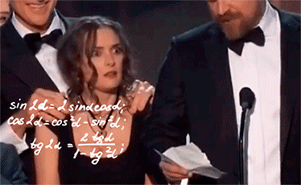

<!-- README.md is generated from README.Rmd. Please edit that file -->

```{r, echo = FALSE}
knitr::opts_chunk$set(
  collapse = TRUE,
  comment = "#>",
  fig.path = "README-"
)
```

# ggeasy

You know how to make `ggplot2` graphics, right? No worries. Piece of `r icon::fa("birthday-cake")`.

Now, can you please rotate the `x` axis labels to vertical?





`ggeasy` is here to make that a little easier.

## Installation

You can install ggeasy from github with:

```{r gh-installation, eval = FALSE}
# install.packages("devtools")
devtools::install_github("jonocarroll/ggeasy")
```

## Example

```{r example}
library(ggplot2)
library(ggeasy)

ggplot(mtcars, aes(hp, mpg)) + 
    geom_point() + 
    easy_rotate_x_labels()
```
