<!-- README.md is generated from README.Rmd. Please edit that file -->

# ggeasy 

<!-- http://www.clker.com/clipart-2-puzzle-pieces-connected.html -->

[](https://github.com/jonocarroll/ggeasy/blob/master/tests/README.md)
[](https://travis-ci.org/jonocarroll/ggeasy)
[](https://ci.appveyor.com/project/jonocarroll/ggeasy)
[](https://github.com/jonocarroll/ggeasy/actions)
[](https://codecov.io/gh/jonocarroll/ggeasy?branch=master)
[](https://CRAN.R-project.org/package=ggeasy)

You know how to make `ggplot2` graphics, right? No worries. Piece of
cake.

Now, can you please rotate the `x` axis labels to vertical?


<!--  -->
<!--  -->

`ggeasy` is here to make that a little easier.

## Installation

You can install the latest released version of `ggeasy` from CRAN with:

``` r
install.packages("ggeasy")
```

or the bleeding-edge development version from GitHub with

``` r
# install.packages("remotes")
remotes::install_github("jonocarroll/ggeasy")
```

## Reference

See the [`pkgdown` site](https://jonocarroll.github.io/ggeasy/).

[@amrrs](https://github.com/amrrs) a.k.a.
[@1littlecoder](https://twitter.com/1littlecoder) has produced a video
walkthrough using `ggeasy` which covers some of the major features:

[](https://youtu.be/iAH1GJoBZmI)

## Examples

``` r
library(ggplot2)
library(ggeasy)

# rotate x axis labels
ggplot(mtcars, aes(hp, mpg)) + 
    geom_point() + 
    easy_rotate_x_labels()
```

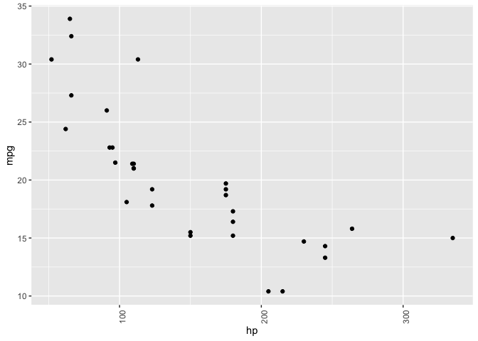<!-- -->

``` r
# rotate y axis labels
ggplot(mtcars, aes(hp, mpg)) + 
    geom_point() + 
    easy_rotate_y_labels()
```

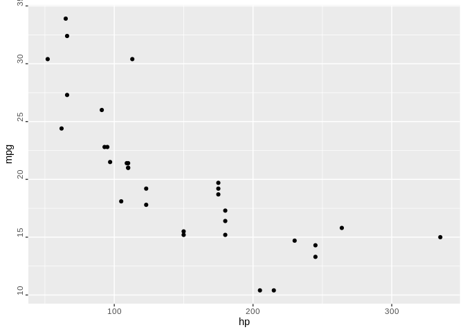<!-- -->

``` r
# remove 'size' legend
ggplot(mtcars, aes(wt, mpg, colour = cyl, size = hp)) +
    geom_point() +
    easy_remove_legend(size)
```

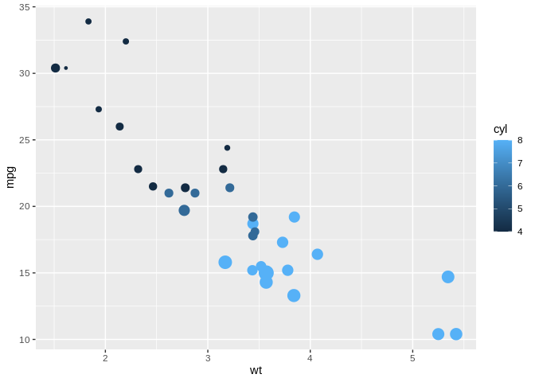<!-- -->

``` r
# make the x axis labels larger
ggplot(mtcars, aes(mpg, hp)) +
  geom_point() +
  easy_x_axis_labels_size(22)
```

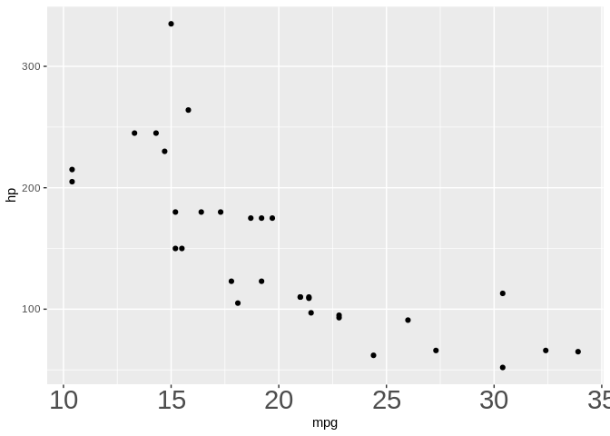<!-- -->

``` r
# make all the text red
ggplot(mtcars, aes(mpg, hp)) +
  geom_point(aes(fill = gear)) +
  easy_all_text_color("red")
```

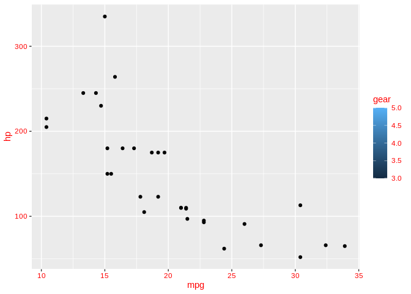<!-- -->

``` r
# remove just x axis
ggplot(mtcars, aes(wt, mpg)) +
  geom_point() + 
  easy_remove_x_axis()
```

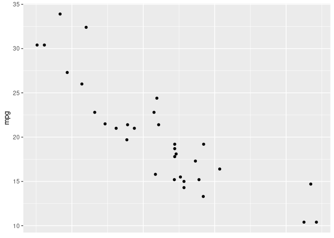<!-- -->

``` r
# remove y axis ticks
ggplot(mtcars, aes(wt, mpg)) +
  geom_point() + 
  easy_remove_y_axis(what = "ticks")
```

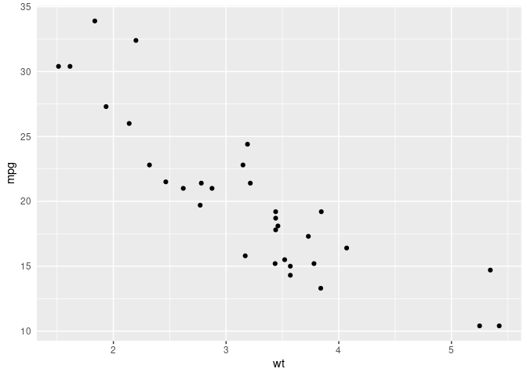<!-- -->

``` r
# move legends to bottom
ggplot(mtcars, aes(wt, mpg, colour = cyl, size = hp)) +
  geom_point() + 
  easy_move_legend("bottom")
```

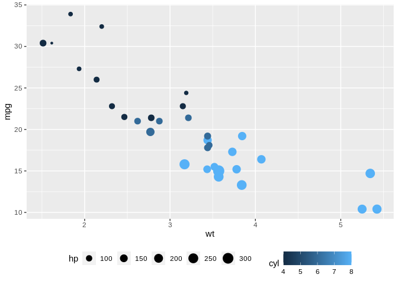<!-- -->

``` r
# move legend to left side
ggplot(mtcars, aes(wt, mpg, colour = cyl, size = hp)) +
  geom_point() +
  easy_legend_at("left")
```

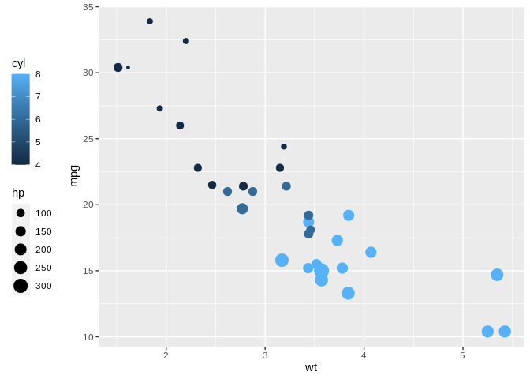<!-- -->

``` r
# Make legends horizontal
ggplot(mtcars, aes(wt, mpg, colour = cyl, size = hp)) +
  geom_point() + easy_rotate_legend("horizontal")
```

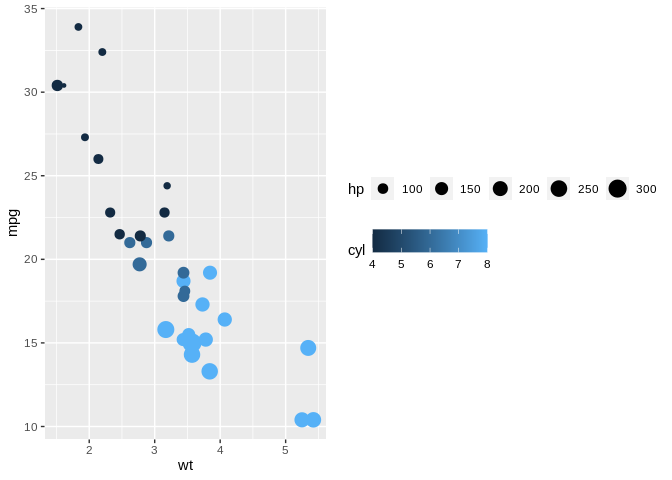<!-- -->

``` r
# use labelled variables
iris_labs <- iris
labelled::var_label(iris_labs$Species) <- "Flower\nSpecies"
labelled::var_label(iris_labs$Sepal.Length) <- "Length of Sepal"
iris_labs_2 <- iris_labs
labelled::var_label(iris_labs_2$Species) <- "Sub-genera"

# use variable labels automatically
ggplot(iris_labs, aes(x = Sepal.Length, y = Sepal.Width)) +
    geom_line(aes(colour = Species)) + 
    geom_point(data = iris_labs_2, aes(fill = Species), shape = 24) +
    easy_labs()
```

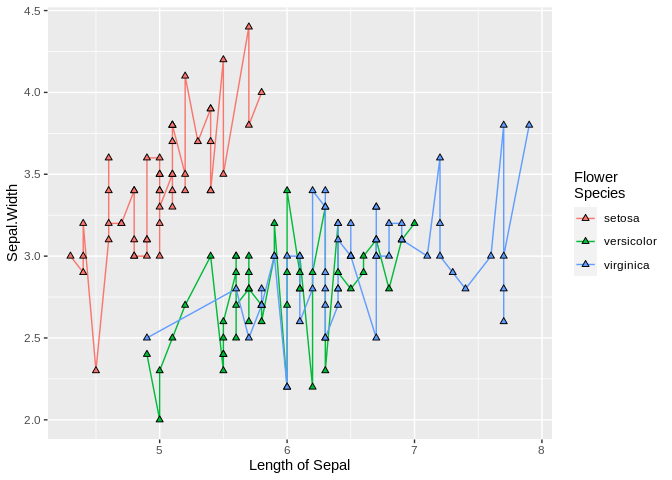<!-- -->

These functions will try to teach you the ‘official’ way to achieve
these goal, usually via the `teach` argument (where implemented)

``` r
ggplot(mtcars, aes(hp, mpg)) + 
    geom_point() + 
    easy_rotate_y_labels(angle = "startatbottom", teach = TRUE)
#> easy_rotate_y_labels call can be substituted with:
#> theme(axis.text.y = element_text(angle = 90, hjust = 0))
```

<!-- -->

``` r
ggplot(mtcars, aes(wt, mpg)) +
  geom_point() + 
  easy_remove_y_axis(what = "ticks", teach = TRUE)
#> easy_remove_y_axis call can be substituted with:
#> theme(axis.ticks.y = element_blank())
```

<!-- -->

## Credits

Many thanks to [Sébastien Rochette (@statnmap)](https://statnmap.com/)
for the design and execution of the hex logo.
