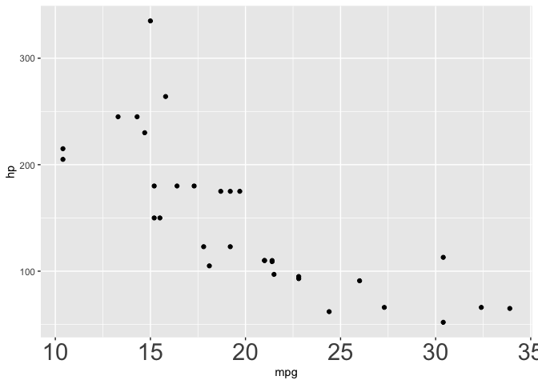
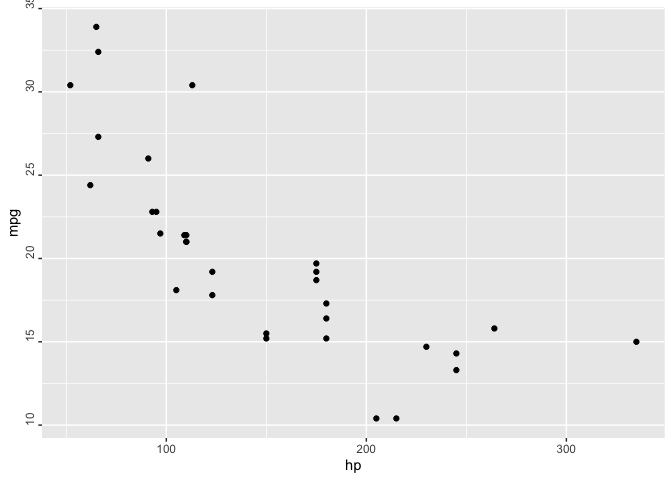

<!-- README.md is generated from README.Rmd. Please edit that file -->

# ggeasy 

<!-- http://www.clker.com/clipart-2-puzzle-pieces-connected.html -->

[](https://github.com/jonocarroll/ggeasy/tree/cleanup/sept18/tests/README.md)
[](https://travis-ci.org/jonocarroll/ggeasy)

# [ggeasy](https://jonocarroll.github.io/ggeasy/)

You know how to make `ggplot2` graphics, right? No worries. Piece of
cake.

Now, can you please rotate the `x` axis labels to
vertical?


`ggeasy` is here to make that a little easier.

## Installation

You can install ggeasy from github with:

``` r
# install.packages("devtools")
devtools::install_github("jonocarroll/ggeasy")
```

## Reference

See the [`pkgdown` site](https://jonocarroll.github.io/ggeasy/).

## Examples

``` r
library(ggplot2)
library(ggeasy)

ggplot(mtcars, aes(hp, mpg)) + 
    geom_point() + 
    easy_rotate_x_labels()
```

<!-- -->

``` r

ggplot(mtcars, aes(hp, mpg)) + 
    geom_point() + 
    easy_rotate_y_labels()
```

<!-- -->

``` r

ggplot(mtcars, aes(wt, mpg, colour = cyl, size = hp)) +
    geom_point() +
    easy_remove_legend(size)
```

<!-- -->

``` r

iris_labs <- iris
labelled::var_label(iris_labs$Species) <- "Flower\nSpecies"
labelled::var_label(iris_labs$Sepal.Length) <- "Length of Sepal"
iris_labs_2 <- iris_labs
labelled::var_label(iris_labs_2$Species) <- "Sub-genera"

ggplot(iris_labs, aes(x = Sepal.Length, y = Sepal.Width)) +
    geom_line(aes(colour = Species)) + 
    geom_point(data = iris_labs_2, aes(fill = Species), shape = 24) +
    easy_labs()
```

<!-- -->

These functions will try to teach you the ‘official’ way to achieve
these goal, usually via the `teach` argument (where implemented)

``` r
ggplot(mtcars, aes(hp, mpg)) + 
    geom_point() + 
    easy_rotate_y_labels(angle = "startatbottom", teach = TRUE)
#> easy_rotate_y_labels call can be substituted with:
#> theme(axis.text.y = element_text(angle = 90, hjust = 0))
```

<!-- -->
