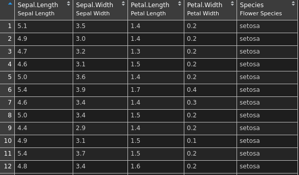

This package allows easy access to some common `ggplot2` tasks. 

```{r, warning = FALSE, message = FALSE}
library(ggplot2)
library(patchwork)
library(labelled)
library(ggeasy)
```

## Rotate Plot Labels

Rotating the `x` axis labels is a very frequently looked up task, and we can make it easier. If we create a simple `ggplot2` plot

```{r}
p <- ggplot(mtcars, aes(hp, mpg)) + geom_point()
```

then by default, this looks like

```{r, fig.width = 5, fig.height = 5}
p + labs(title = "ggplot2 default")
```

We can perform various rotations though

```{r, fig.width = 8, fig.height = 8}
p1 <- p + 
    easy_rotate_x_labels() + 
    labs(title = "default rotation")
p2 <- p + 
    easy_rotate_x_labels(angle = 45, side = "right") + 
    labs(title = "angle = 45")
p3 <- p + 
    easy_rotate_x_labels("startattop") + 
    labs(title = "text starts at top")
p4 <- p + 
    easy_rotate_x_labels("startatbottom") + 
    labs(title = "text starts at bottom")

(p1 + p2) / (p3 + p4)
```

## Remove Legends

Removing legends is made easier by the `easy_remove_legend` function.  When called without arguments, all legends are removed (equivalent to `theme(legend.position = "none")`). Alternatively, the names of aesthetics for which legends should be removed can be passed.

```{r, fig.width = 8, fig.height = 8}
p <- ggplot(mtcars, aes(wt, mpg, colour = cyl, size = hp)) +
    geom_point()

p1 <- p + 
    labs(title = "With all legends")
p2 <- p + 
    easy_remove_legend() + 
    labs(title = "Remove all legends")
p3 <- p + 
    easy_remove_legend(size) + 
    labs(title = "Remove size legend")
p4 <- p + 
    easy_remove_legend(size, color) + 
    labs(title = "Remove both legends specifically")

(p1 + p2) / (p3 + p4)
```

## Remove Grid Lines

Grid lines can be completely removed, or removed in only one direction

```{r, fig.width = 8, fig.height = 8}
p <- ggplot(mtcars, aes(hp, mpg)) + geom_point()

p1 <- p + easy_remove_gridlines() + 
  labs(title = "Remove all gridlines")

p2 <- p + easy_remove_gridlines(major = FALSE) +
  labs(title = "Remove minor gridlines")

p3 <- p + easy_remove_gridlines(minor = FALSE) +
  labs(title = "Remove minor gridlines")

p4 <- p + easy_remove_x_gridlines() + 
  labs(title = "Remove x gridlines")
# or
# p + easy_remove_gridlines(axis = "x")

# p + easy_remove_y_gridlines()

(p1 + p2) / (p3 + p4)
```

## Plot Labels

Changing plot labels to a specified string isn't particularly difficult (`labs(x = "my label")`) but wouldn't it be even nicer if you could just add labels to your `data.frame` columns (e.g. using `labelled::var_labels()`) and have these reflected in your plot. `easy_labs()` makes this possible.

```{r}
## create a copy of the iris data
iris_labs <- iris

## add labels to the columns
lbl <- c('Sepal Length', 'Sepal Width', 'Petal Length', 'Petal Width', 'Flower\nSpecies')
var_label(iris_labs) <- split(lbl, names(iris_labs))
```

These are visible if you use `View(iris_labs)` in RStudio



```{r, fig.width = 8, fig.height = 8}
p <- ggplot(iris_labs, aes(x = Sepal.Length, y = Sepal.Width)) +
  geom_line(aes(colour = Species))

p1 <- p + labs(title = "default labels")
p2 <- p + 
    easy_labs() + 
    labs(title = "Replace titles with column labels")
p3 <- p + 
    easy_labs(x = 'My x axis') + 
    labs(title = "Manually add x axis label")
    
iris_labs_2 <- iris_labs
var_label(iris_labs_2$Species) <- "Sub-genera"

p4 <- p + geom_point(data = iris_labs_2, aes(fill = Species), shape = 24) +
    easy_labs() + 
    labs(title = "Additional labels can be added in other aesthetics")

(p1 + p2) / (p3 + p4)
```

easy_labs also extends to facetting

```{r, fig.width = 8, fig.height = 8}
p4 + geom_point(data = iris_labs_2, aes(fill = Species), shape = 24) +
    facet_wrap(~Species) + 
    easy_labs() + 
    labs(title = "Facetting works")
```


